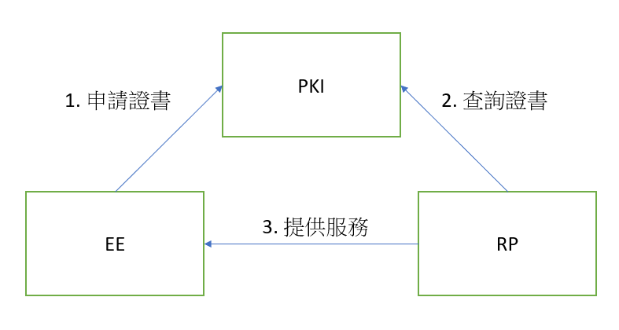
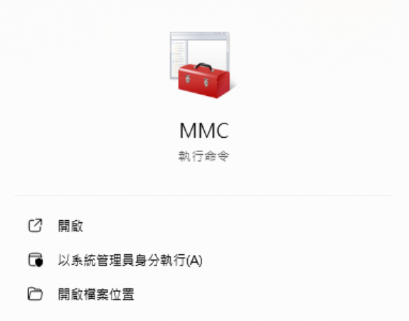

# PKI

基本原理：非對稱加密技術(**Asymmetric cryptography)**。包含一對密鑰：公鑰和私鑰。

公鑰用於加密資料，私鑰用於解密資料。

私鑰用於簽署數據，公鑰用於驗證簽名。

- **公鑰 (Public Key)**：可以公開分發的密鑰。
- **私鑰 (Private Key)**：需要保密的密鑰，僅有特定人士知道。
- **用途**
    - 身份驗證（Authentication）： 通過憑證來確認使用者的身份，確保通訊雙方的真實性。
    - 資料機密性（Confidentiality）： 透過公鑰和私鑰的加密和解密過程，保護通訊中的資料遠離未經授權的訪問。
    - 資料完整性（Integrity）： 透過數位簽章來確保資料在傳輸過程中沒有被修改。
    - 不可否認性（Non-repudiation）： 通過數位簽章確保發送方無法否認其發送的消息。

## PKI 組成

1. **CA, Certificate Authority**：
    - *CA* 是 PKI 的核心，負責簽發、管理、撤銷證書。
    - 是可信任的第三方機構，透過簽名證書來驗證證書擁有者的身份。
    - 參考: [*CA*](../CA/README.md)
2. **RA, Registration Authority**：
    - *RA* 是 *CA* 的輔助機構，負責驗證用戶身份並向 *CA* 提交證書簽發請求。
    - 讓 *CA* 不需要直接與所有用戶進行交互，具有更高的安全性。
    
    
    
    - 功能：
        1. 用戶身份驗證： *RA* 負責確認憑證申請者的身份。包括驗證申請者是否擁有合法的身份檔案、確保他們是憑證所聲明的實體，以及確保憑證的使用是合法的。
        2. 憑證申請管理： *RA* 協助用戶提交憑證申請，並確保提交的資訊是完整和準確的。包括憑證的有效期限、密碼保護和其他相關的資訊。
        3. 金鑰生成： 若用戶不具備生成金鑰對的能力，可由 *RA* 代由生成。通常是在用戶身份經過驗證後進行的。
        4. 憑證撤銷： 如果使用者的憑證需要被撤銷，*RA* 將協助處理相應的撤銷流程。通常是在憑證過期、用戶的私密金鑰遭到洩露或其他安全風險發生時進行的。
        5. 日誌和監控： 記錄所有憑證申請和相關的操作，以便追蹤憑證的使用情況、進行監控並提供後續的審計。
        6. 與 *CA* 的協作：將用戶的憑證申請資訊傳送給 *CA* 進行憑證的最終簽發。*RA* 確保申請流程符合安全標準，並將已驗證的用戶資料提供給 *CA* 進行憑證簽發。
3. **VA, Validation Authority：**
    - 確認驗章和憑證是否有效的單位。
4. **Directory Authority, DA / Certificate Repository**：
    - 儲存和分發證書及證書撤銷列表（CRL）、以及維持線上證書狀態協議（OCSP）。
    - 通常以公開可訪問的形式存在，以便其他用戶和應用程序能夠查詢證書的狀態。
5. **RP, Relying Party：**
    - 信賴 PKI 架構的服務提供者。
    
    
    
6. **End Entities, EE**：
    - 最終使用者，如個人用戶、伺服器、應用程式等。

## PKI 運作機制

Alice 給Bob她的public key，Bob將資料用收到的public key加密傳回Alice，Alice再用自己的private key解密 —> Bob如何確認收到的public key的真實性?

**答：Digital certificate**

1. **證書申請與簽發**：
    - 用戶生成密鑰對並向 *RA* 提交證書申請。*RA* 驗證用戶身份後，將請求轉發給 *CA*。
    - *CA* 簽發證書並將其分發給用戶和證書存儲庫。
2. **證書的驗證**：
    - 用戶或應用程序在收到證書後，首先檢查證書的有效性，包括簽發者是否可信、證書是否在有效期內以及是否被撤銷。
3. **數據加密與解密**：
    - 使用接收者的公鑰加密數據，只有擁有對應私鑰的接收者才能解密
4. **簽名與驗證**：
    - 由數據發送者用其私鑰簽署數據，接收者使用發送者的公鑰來驗證簽名
    - 若為文件的靜態傳輸、或是持久性的數，則通常只需要一次簽名和驗證

## PKI 運作流程

- **憑證申請**
    1. *EE*  向 *RA* 送出憑證申請
    2. *RA* 將資訊審核，通過後轉送給 *CA* 進行簽章變成憑證
    3. *CA* 簽章完後，將憑證轉送回 *RA*，再轉送回 *EE* 存放
- **憑證驗證**
    1. *EE* 使用憑證對資料做hash
    2. *EE* 將資料、簽章值與憑證交給 *RP* 來要求服務
    3. *RP* 將剛剛收到的資訊轉交給 *VA* 來進行檢驗
    4. *VA* 檢驗簽章正確性、憑證有效性，驗證完成後通知 *RP* 結果
    5. *RP* 根據結果決定是否提供 *EE* 服務

## 證書類別

- **身份憑證（Identity Certificate）：**
    - 用戶A必須先行向 *CA* 憑證頒發機構（Certificate Authority）提出憑證簽名請求（Certificate Signing Request），申請簽發用戶A的身份憑證，流程如下：
        - 用戶A必須先向 *CA* 憑證頒發機構提交用戶A自己的身份、公開金鑰等相關資訊
        - 頒發機構會先結合這些資訊進行HASH運算，再使用非對稱私密金鑰進行簽名加密運算，形成該機構的數位簽章（CA Signature）
        - 最後，頒發機構將用戶的身份資訊、公開金鑰、與數位簽章，以*X.509 v3*的數位憑證格式(所有憑證均使用此格式) 綁定在一起，生成用戶身份憑證。
    
    
    
- **根憑證（Root Certificate）：**
    - 根憑證是一種自簽的憑證（Self-Signed certificate），具有相同的憑證發行者名稱（Issuer Name）與憑證持有者名稱（Subject Name）
    - 由根憑證機構（Root CA）自己的私鑰來簽發根憑證機構自己的公鑰。
    - 沒有上層機構再為其本身作數位簽章，所以都是自簽憑證，擔任[**信任鏈**](static\trust_anchor.md)起點的角色。
    - 可利用Windows內建之MMC、或是在指令列輸入***certmgr.msc***查看
    
    
    
    
    
    